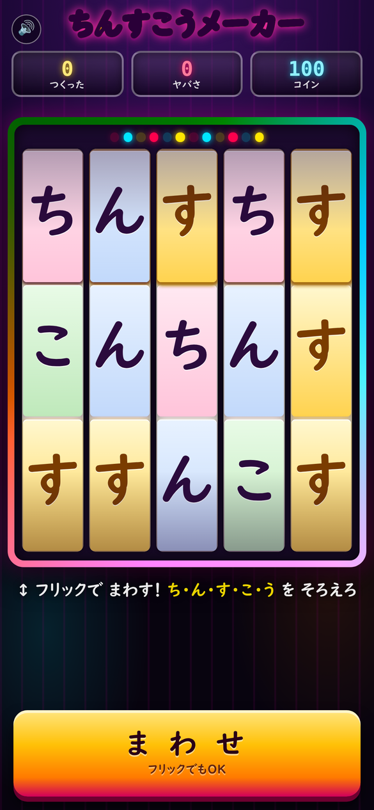
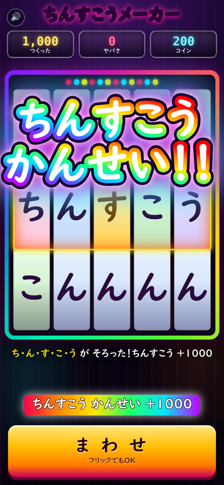
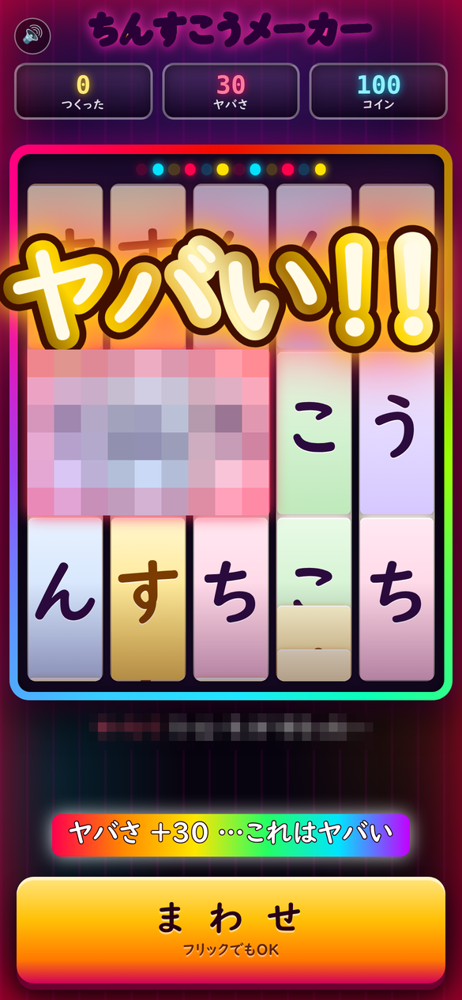

# ちんすこうメーカー (Chinsuko Maker)

5つのリールが **「ち・ん・す・こ・う」の5文字だけ**で回る、子ども向けのスロットゲーム（Androidアプリ）。
5文字が並んで「ちんすこう」になるとレインボーの大当たり、危うい言葉が揃うと金縁の大文字で「ヤバい！！」。

<p>



</p>

- 対象: 小学校低学年（画面の字はひらがな・カタカナだけ）
- 中身は **HTML5 一枚もの**（`web/index.html`）を WebView で包んだだけ。依存ライブラリなし・APK 約 81KB
- パッケージ: `com.tsubota.chinsuko` / minSdk 26 / targetSdk 34

## インストール（Android）

1. [Releases](https://github.com/tsubotan1985/chinsuko-maker/releases) から `ChinsukoMaker-1.1.apk`（最新）をダウンロード
2. 端末でそのファイルを開く（「提供元不明のアプリ」の許可を求められたら許可する）
3. インストールして起動

ビルド済み APK は置いていないので、必要な人は上の Releases から取るか、下の手順でビルドしてください。

## 操作

- リールを**上→下にフリック**（下→上でも回る）＝回転。回転中のタップで左から順に停止（目押し）
- 下部の**「ま わ せ」**ボタンでも回転
- 小さいスピーカーボタンで音の ON/OFF

## 出玉

リールの3行すべてを見て、言葉が並んでいれば当たり（左から何文字目でもよい）。
当選は回転開始時に抽選し、リールはその文字で止まる（本物のパチスロと同じ制御）。
文字は「ち・ん・す・こ・う」の5種類だけなので、成立する言葉もこの5文字で作れるものに限られる。

| 揃う言葉 | 演出 |
|---|---|
| ちんすこう | レインボー縁の大文字「ちんすこう かんせい！！」＋全画面フラッシュ＋虹紙吹雪＋ファンファーレ（+1000） |
| あの言葉（5文字・6種類） | 金縁の大文字「ちょうヤバい!!!!!」＋金粉＋サイレン＋ヤバさ +100 |
| あの言葉（4文字・2種類） | 金縁の大文字「ヤバい！！」＋金粉＋ヤバさ +40 |
| あの言葉（3文字・3種類） | 金縁の大文字「ヤバい！！」＋金粉＋ヤバさ +30 |
| 2文字まで揃った | 「おしい！！」演出（3文字だとコイン +30） |

「あの言葉」＝こどもが大喜びする下ネタ系の語。読んで気を悪くする人がいるので、このリポジトリでは
**列挙を伏せています**（実際の語は `web/index.html` の `WORDS` にそのまま入っています）。

大文字の演出は2.6秒で自動的に消えるほか、**次の回転を始めた時点で即座に消える**（`clearBig()`）。
対象が低学年なので、演出もUIもひらがな・カタカナ表記（「危うい」→「ヤバい」、「完成」→「かんせい」）。

## 構成

```
web/index.html                     ゲーム本体（HTML/CSS/JS 全部入り・約38KB）
app/assets/index.html              ↑をビルド時にコピーした同梱物
app/src/com/tsubota/chinsuko/MainActivity.java   WebView を貼るだけの Activity
app/res/values/{strings,styles}.xml            アプリ名・テーマ
app/res/mipmap-*/ic_launcher.png               アイコン（tools/make_icon.py で生成）
app/build.sh                       Gradle なしビルド（aapt2→javac→d8→zipalign→apksigner）
tools/make_icon.py                 PNG アイコン生成（PIL）
```

## ビルド

`app/build.sh` は Android SDK（build-tools / platforms）と JDK 17 があれば動きます（Gradle 不要）。

```bash
python3 tools/make_icon.py     # アイコン（初回/デザイン変更時のみ）
bash app/build.sh              # APK 生成 → app/build/ChinsukoMaker-<版>.apk
```

バージョンは `app/AndroidManifest.xml` の `versionName` / `versionCode` が唯一の出典です
（`build.sh` がそこを読んで `--version-name` とAPK名に使うので、二重管理にならない）。

JS だけ直す場合は `web/index.html` を編集して `bash app/build.sh` を再実行（assets へ自動反映）。

署名はデバッグ用の鍵を自動生成します。ストア配布する場合は `app/build.sh` の署名部分を自分の鍵に差し替えてください。

## 言葉の増減

`web/index.html` の `WORDS` に足す。**その言葉が使う文字は「ち・ん・す・こ・う」の中だけ**にすること
（リールはこの5文字しか出さないので、他の文字を混ぜると絶対に揃わない）。

```js
const WORDS=[ {w:'***', kind:'risky', wt:1.6}, ... ];   // 実際の語は伏せています
```

- `kind:'happy'` … ちんすこう（レインボー演出）
- `kind:'risky'` … ヤバい（金縁演出）
- `wt` … 抽選の重み。3文字は1.0〜1.6、4文字は1.0、**5文字は0.6**（長い語ほど演出が大きいので、
  出しすぎないようにしつつ、当たりの種類を増やす。5文字は偶然揃う率がほぼ0なので演出を足しても安全）
- タイルの色は文字ごとに固定（`CHAR_BG`）。`す`だけ金色の特別扱い

## リールの作り（実装メモ）

コマを1枚ずつ絶対配置して円環で回している（`render()`）。

- 帯を1本スクロールさせる方式だと**帯の端でコマが窓から外れて空白（透明）になる**ためこの方式にした
- `d = ((k-pos)%STRIP+STRIP)%STRIP - STRIP/2` の符号付き距離で `translateY(d*CELL)`
- `|d|>4` のコマは transform を書かない（毎フレームの書き込みを5列×9枚に抑える）
- 窓から外れたコマは中身をランダムに**入れ替える**（固定のままだと同じ当たり並びが繰り返される）
- 停止までのコマ数は**ランダム**（`dist=6+rand(0..10)`）。固定ステップだと出目が固定される
- 回転中も文字が読めるように、速度線は描かず上下20%に薄い陰だけ入れている
- **表示位置と判定位置は `cellIndex()` ひとつで解決する**。別々に計算すると、画面と違う文字で当たり判定する

## 検証フック（テスト用）

`window.__slot` に以下を用意。演出を毎回同じ条件で確認できる。

```js
__slot.play('chinsuko')          // ちんすこうで1回転（シミュレーション時間で完走）
__slot.play('word:***')          // 指定の言葉で1回転（*** は WORDS にある語）
__slot.play('chinsuko', 2)       // 2秒ぶんだけ進める（リーチ途中など）
__slot.tick(3)                   // 3秒ぶん時間を進める
__slot.state()                   // 3行の文字・成立した言葉・カウンタを JSON で返す
```

- `?t=word:***` を URL に付けると、その言葉で1回転した状態で開く

## ライセンス

MIT License（`LICENSE` を参照）。
